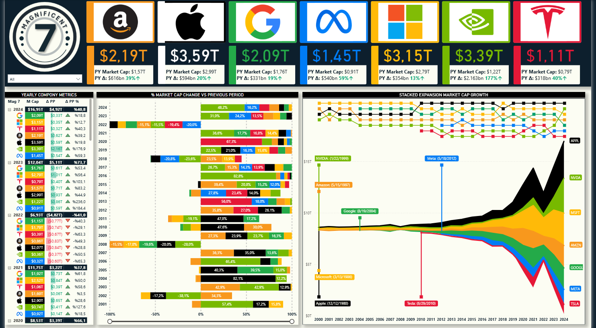
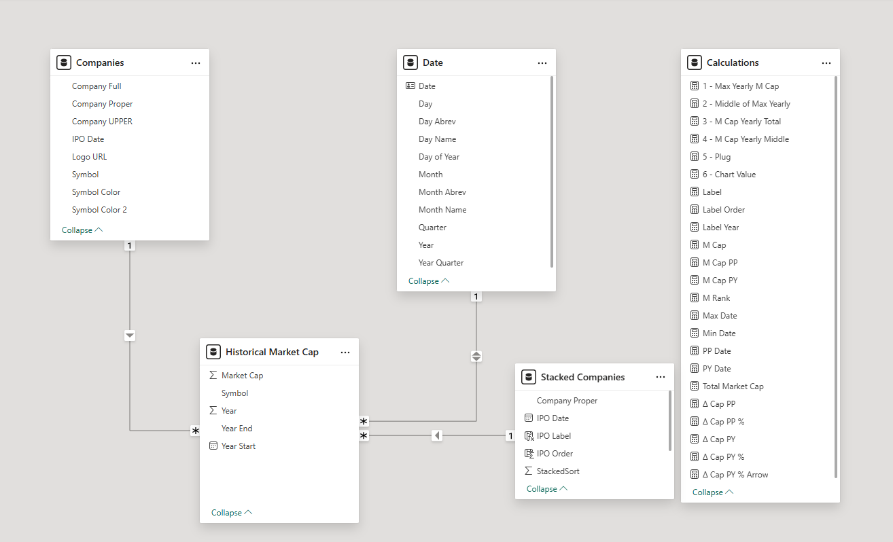

# 📊 Magnificent 7 — Power BI Dashboard
An interactive Power BI dashboard tracking the historical market capitalization and performance of the **Magnificent 7** tech companies: Amazon, Apple, Google, Meta, Microsoft, NVIDIA, and Tesla.



## Overview
This dashboard provides a comprehensive view of the Magnificent 7's market cap history, yearly performance changes, and relative growth since their IPO dates. It is built entirely in Power BI with a custom data model and DAX calculations.

**Current Combined Market Cap (2024): $16.95T**
 
| Company | Market Cap | YoY Change |
|---------|-----------|------------|
| Apple | $3.59T | +20% ↑ |
| NVIDIA | $3.39T | +177% ↑ |
| Microsoft | $3.15T | +13% ↑ |
| Amazon | $2.19T | +39% ↑ |
| Google | $2.09T | +19% ↑ |
| Meta | $1.45T | +59% ↑ |
| Tesla | $1.11T | +40% ↑ |

## Data Model
The report uses a star-schema-inspired data model with **five tables**:

```
Companies ──────────────── Historical Market Cap      Plug Records
    │                            │                    (unconnected)
    │                            │
    └──────── Date ──────────────┘
                  │
                  │
           Stacked Companies
```


### Tables
**Companies** — Master list of the 7 companies.
- `Company Full`, `Company Proper`, `Company UPPER`
- `IPO Date`, `Logo URL`, `Symbol`, `Symbol Color`, `Symbol Color 2`

**Historical Market Cap** — Yearly market cap fact table.
- `Market Cap`, `Symbol`, `Year`, `Year End`, `Year Start`

**Date** — Standard date dimension.
- `Date`, `Day`, `Day Abrev`, `Day Name`, `Day Name`, `Day of Year`
- `Month`, `Month Abrev`, `Month Name`, `Quarter`, `Year`, `Year Quarter`

**Stacked Companies** — Supporting table for the stacked area chart tooltip.
- `Company Proper`, `IPO Date`, `IPO Label`, `IPO Order`, `StackedSort`
- `Symbol`, `Symbol Color`

**Plug Records** — Isolated table used to generate plug/gap values for the stacked area chart in pre-IPO years.
- `Market Cap`, `Symbol`, `Year`, `Year End`, `Year Start`

### Key DAX Measures (Calculations Table)

| Measure | Description |
|---------|-------------|
| `M Cap` | Current period market cap |
| `M Cap PP` | Market cap in the previous period |
| `M Cap PY` | Market cap in the previous year |
| `Total Market Cap` | Sum across all selected companies |
| `Δ Cap PP` | Absolute change vs previous period |
| `Δ Cap PP %` | % change vs previous period |
| `Δ Cap PY` | Absolute change vs previous year |
| `Δ Cap PY %` | % change vs previous year |
| `Δ Cap PY % Arrow` | % change with directional arrow indicator |
| `1 - Max Yearly M Cap` | Maximum yearly market cap for scaling |
| `2 - Middle of Max Yearly` | Midpoint for reference line positioning |
| `3 - M Cap Yearly Total` | Aggregated yearly total |
| `4 - M Cap Yearly Middle` | Midpoint of yearly range |
| `5 - Plug` | Plug value for chart alignment |
| `6 - Chart Value` | Final value used in visual rendering |
| `Label`, `Label Order`, `Label Year` | Dynamic label controls |
| `M Rank` | Rank of company by market cap |
| `Max Date`, `Min Date` | Date range boundaries |
| `PP Date`, `PY Date` | Previous period / previous year date references |

## Visuals
### 1. KPI Header Cards
Displays each company's logo, current market cap, prior year market cap, and absolute/percentage change for the selected period.

### 2. Yearly Company Metrics Table
A matrix showing yearly market cap, period-over-period absolute delta, and percentage delta — with conditional formatting arrows.

### 3. % Market Cap Change vs Previous Period (Bar Chart)
Horizontal stacked bar chart showing each company's yearly growth rate contribution from 2001 to 2024. Positive and negative periods are clearly color-coded.

### 4. Stacked Expansion Market Cap Growth (Area Chart)
A stacked area chart showing cumulative market cap growth from 2000 to 2024. IPO entry points are annotated for each company, making it easy to see when each one joined the combined market cap stack.

## Technologies Used
* **Data Visualization:** Power BI
* **Data Modeling:** Power Pivot / Power BI Data Model (Star Schema)
* **Calculations:** DAX (Data Analysis Expressions)
* **Data Cleaning & Transformation:** Power Query
---
Disclaimer: This project is a portfolio piece. The data utilized is synthetic/mock data created for demonstration purposes.

